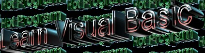



## Learn Visual Basic 6 and 5

### Description

This program lets u learn Visual Basic 6.0, it teaches you API's, Random, Timers, Refreshing, Source Getting, Counting, Multiplying, Using Music, Loading things, and more! It has a burst of teaching you, what are you waiting for! DOWNLOAD NOW! Learn Visual Basic. Please vote. I hope you like it, I designed this good and stuff, it took me time to make. :)
 
### More Info
 

             |
---                |---
**Submitted On**   |2002-12-07 11:12:44
**By**             |[Programmerproof](https://github.com/Planet-Source-Code/PSCIndex/blob/master/ByAuthor/programmerproof.md)
**Level**          |Intermediate
**User Rating**    |4.4 (22 globes from 5 users)
**Compatibility**  |VB 4\.0 \(32\-bit\), VB 5\.0, VB 6\.0
**Category**       |[Complete Applications](https://github.com/Planet-Source-Code/PSCIndex/blob/master/ByCategory/complete-applications__1-27.md)
**World**          |[Visual Basic](https://github.com/Planet-Source-Code/PSCIndex/blob/master/ByWorld/visual-basic.md)
**Archive File**   |[Learn\_Visu1509371272002\.zip](https://github.com/Planet-Source-Code/programmerproof-learn-visual-basic-6-and-5__1-41382/archive/master.zip)

